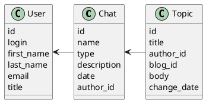

# Компонентная архитектура
<!-- Состав и взаимосвязи компонентов системы между собой и внешними системами с указанием протоколов, ключевые технологии, используемые для реализации компонентов.
Диаграмма контейнеров C4 и текстовое описание. 
-->
## Компонентная диаграмма

```plantuml
@startuml
!include https://raw.githubusercontent.com/plantuml-stdlib/C4-PlantUML/master/C4_Container.puml

AddElementTag("microService", $shape=EightSidedShape(), $bgColor="CornflowerBlue", $fontColor="white", $legendText="microservice")
AddElementTag("storage", $shape=RoundedBoxShape(), $bgColor="lightSkyBlue", $fontColor="white")

Person(admin, "Администратор")
Person(moderator, "Модератор")
Person(user, "Пользователь")

System_Ext(web_site, "Клиентский веб-сайт", "HTML, CSS, JavaScript, React", "Веб-интерфейс")

System_Boundary(conference_site, "Мессенджер") {
   'Container(web_site, "Клиентский веб-сайт", ")
   Container(client_service, "Сервис авторизации", "C++", "Сервис управления пользователями", $tags = "microService")    
   Container(group_service, "Сервис групповых чатов", "C++", "Сервис групповых чатов", $tags = "microService") 
   Container(PtP_service, "Сервис PtP чатов", "C++", "Сервис управления постами", $tags = "microService")   
   ContainerDb(db, "База данных", "MySQL", "Хранение данных о блогах, постах и пользователях", $tags = "storage")
   
}

Rel(admin, web_site, "Просмотр, добавление и редактирование информации о пользователях, групповых и PtP чатах")
Rel(moderator, web_site, "Модерация контента и пользователей")
Rel(user, web_site, "Регистрация, просмотр/изменение информации в групповых и персональных чатах")

Rel(web_site, client_service, "Работа с пользователями", "localhost/person")
Rel(client_service, db, "INSERT/SELECT/UPDATE", "SQL")

Rel(web_site, group_service, "Работа с групповыми чатами", "localhost/pres")
Rel(group_service, db, "INSERT/SELECT/UPDATE", "SQL")
Rel( db, group_service, "FIND user", "SQL")

Rel(web_site, PtP_service, "Работа с PtP чатами", "localhost/conf")
Rel(PtP_service, db, "INSERT/SELECT/UPDATE", "SQL")
Rel( db, PtP_service, "FIND user", "SQL")


@enduml
```
## Список компонентов  

### Сервис авторизации
**API**:
-	Создание нового пользователя
      - входные параметры: login, пароль, имя, фамилия, email, обращение (г-н/г-жа)
      - выходные параметры: отсутствуют
-	Поиск пользователя по логину
     - входные параметры:  login
     - выходные параметры: имя, фамилия, email, обращение (г-н/г-жа)
-	Поиск пользователя по маске имени и фамилии
     - входные параметры: маска фамилии, маска имени
     - выходные параметры: login, имя, фамилия, email, обращение (г-н/г-жа)

### Сервис групповых чатов
**API**:
- Создание группового чата:
  - Входные параметры: название чата, количество пользователей, автор, дата создания
  - Выходные параметры: идентификатор группового чата
- Добавление пользователя в чат
  - Входные параметры: login
  - Выходные параметры: идентификатор группового чата, количество пользователей
- Добавление сообщения в групповой чат
  - Входные параметры: отсутствуют
  - Выходные параметры: сообщение, login
- Загрузка сообщений группового чата
  - Входные параметры: отсутствуют
  - Выходные параметры: массив с сообщениями (идентификатор чата , название чата, автор, дата создания)

### Сервис PtP чатов
**API**:
- Отправка PtP сообщений пользователю
  - Входные параметры: login 
  - Выходные параметры: сообщение, идентификатор чата 
- Получение PtP списка сообщения для пользователя
  - Входные параметры: идентификатор PtP блога
  - Выходные параметры: массив с сообщениями (идентификатор чата , название чата, автор, дата создания)


### Модель данных
